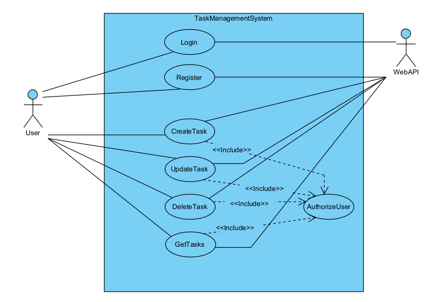
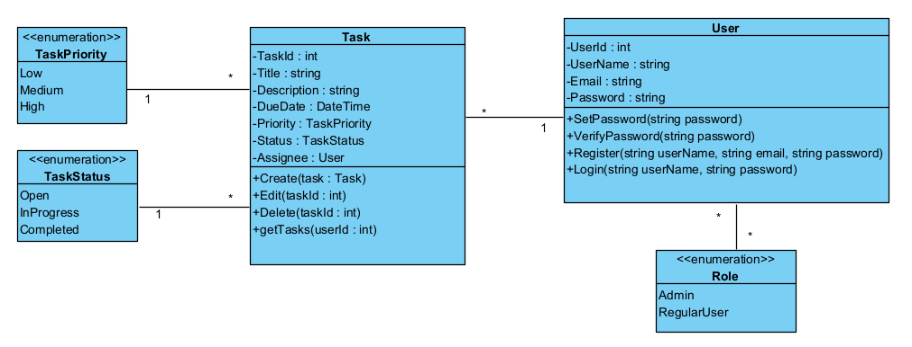

# Task Management System

This Task Management System is a web application developed using .NET Core 6. It allows users to create and manage tasks. The system utilizes MVC for the user interface and Entity Framework Core Code First for data access.

## Features

The system consists of the following components:

### User Authentication:

- Users can register and login to the system.
- User roles are implemented, such as admin and regular user.
- Only authenticated users have access to task creation and management.

### Task Management:

- Users can create, update, and delete tasks.
- Each task has attributes including title, description, due date, priority (low, medium, high), status (open, in progress, completed), and assignee (optional).
- Users can view a list of their tasks.
- Filtering and sorting options are available for the task list, such as by status, priority, and due date.
- Pagination is implemented for the task list.

### API:

- A small API is provided to support task management operations.
- CRUD operations can be performed on tasks using the API.
- Appropriate HTTP methods and status codes are utilized for each operation.
- API endpoints require authentication for security.

### Database:

- The database schema is defined using Entity Framework Core Code First approach.
- Proper relationships between the User and Task entities are implemented.
- Migrations are used to create and update the database schema.

### UI/UX:

- The user interface is implemented with a user-friendly and responsive design using MVC.
- Input fields have appropriate validation.
- Error handling is in place, providing meaningful error messages to users.

## UML Diagrams

### Use Case Diagram



### Class Diagram



## Prerequisites

Before running the Task Management System, ensure you have the following:

- .NET Core 6 SDK installed on your machine.
- Database server (e.g., SQL Server) and connection string configured in the app settings.

## Getting Started

To run the Task Management System locally, follow these steps:

1. Clone the repository to your local machine.
2. Open the solution in your preferred IDE (Visual Studio, Visual Studio Code, etc.).
3. Update the database connection string in the app settings (`appsettings.json` or `appsettings.Development.json`) to match your database configuration.
4. Open a terminal or command prompt and navigate to the project directory.
5. Run the following commands to build and run the application:

```shell
dotnet build
dotnet run
```

6. Open a web browser and access the application at `http://localhost:5000` or the specified URL.

## API Documentation

The Task Management System API provides the following endpoints:

- `GET /api/tasks`: Retrieves a list of tasks.
- `GET /api/tasks/{id}`: Retrieves a specific task by ID.
- `POST /api/tasks`: Creates a new task.
- `PUT /api/tasks/{id}`: Updates an existing task.
- `DELETE /api/tasks/{id}`: Deletes a task by ID.

**Note:** API endpoints require authentication. Include an authorization header with a valid token in your requests.

## Update Database

For creating migration, run this command:
```
dotnet ef --startup-project ..\TaskManagementSystem\  migrations add myMigration
```

For updating database, run this command:
```
dotnet ef --startup-project ..\TaskManagementSystem\ database update
```

## Improvement Suggestion
- Implement same logging mechanism for Web API
- Using Swagger for Web API users(developers)
- Write more unit tests
- Better validation in front-end side
- Create Admin panel to control users

## Contributing

Contributions to the Task Management System are welcome. If you find any issues or have suggestions for improvements, please feel free to open an issue or submit a pull request.

## License

The Task Management System is released under the [MIT License](https://mit-license.org/). Feel free to use, modify, and distribute the code as needed.# Task Management System

This Task Management System is a web application developed using .NET Core 6. It allows users to create and manage tasks. The system utilizes MVC for the user interface and Entity Framework Core Code First for data access.
